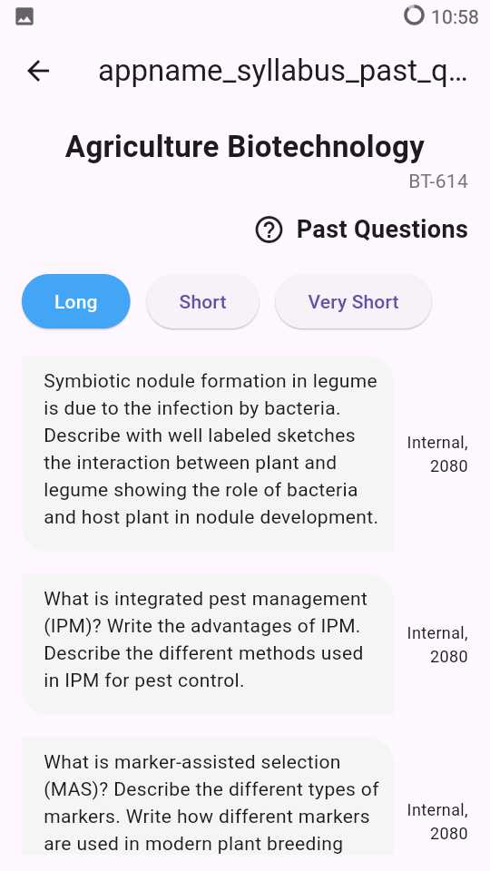
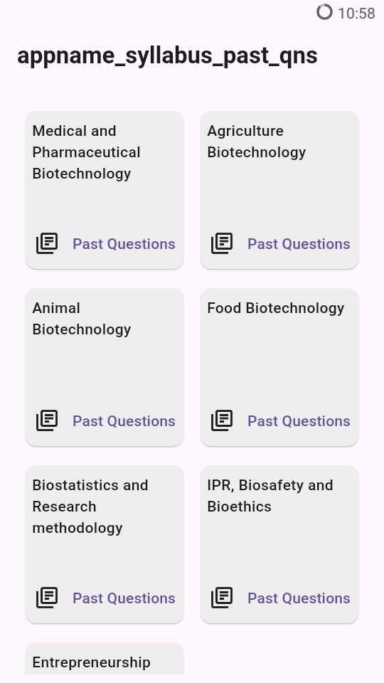
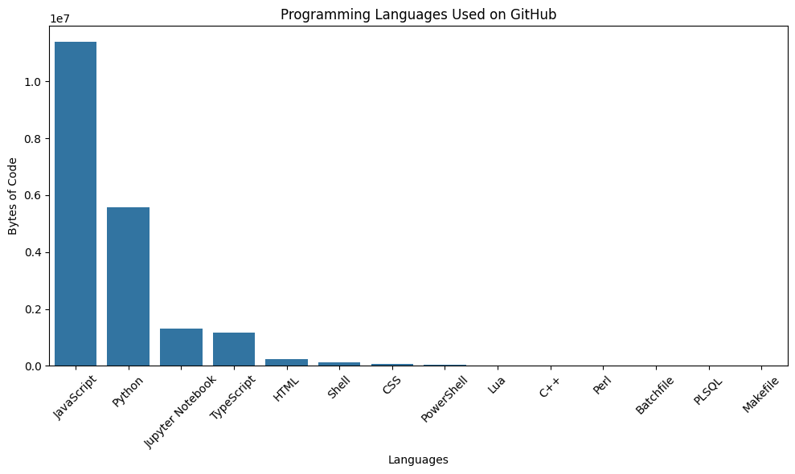

# Rizan B. &nbsp; 

### Hi there! 👋 

I'm pursuing a Masters in Computer Applications from [Indira Gandhi National Open University](https://www.ignou.ac.in), India. 

# Shodh  

Shodh is built in Flutter and uses a Django REST backend. At present, it provides functionalities needed for viewing (and searching) past questions and syllabus for various programs. In future versions, I plan to include a research feed, model questions and some exciting features!

I also have plans to improve the aesthetics once I get the basic features working.

<h2>Screenshots </h2>

<table><tr>
<td>

</td>
<td>

</td>
<td>

</td>
</tr></table> 

## Skills

#### Languages

&nbsp;

&nbsp;
&nbsp;

#### Libraries and Frameworks

&nbsp;
&nbsp;

&nbsp;

&nbsp;

#### Databases

&nbsp;
&nbsp;
&nbsp;

#### Tools and Technologies

&nbsp;

&nbsp;
 &nbsp;

## Connect with me:

## Languages Used ##

Please note that this doesn't reflect my proficiency with these languages. It's a fun diagram to see what languages are most used in my public repos. (Updated every day using cron/ github actions)